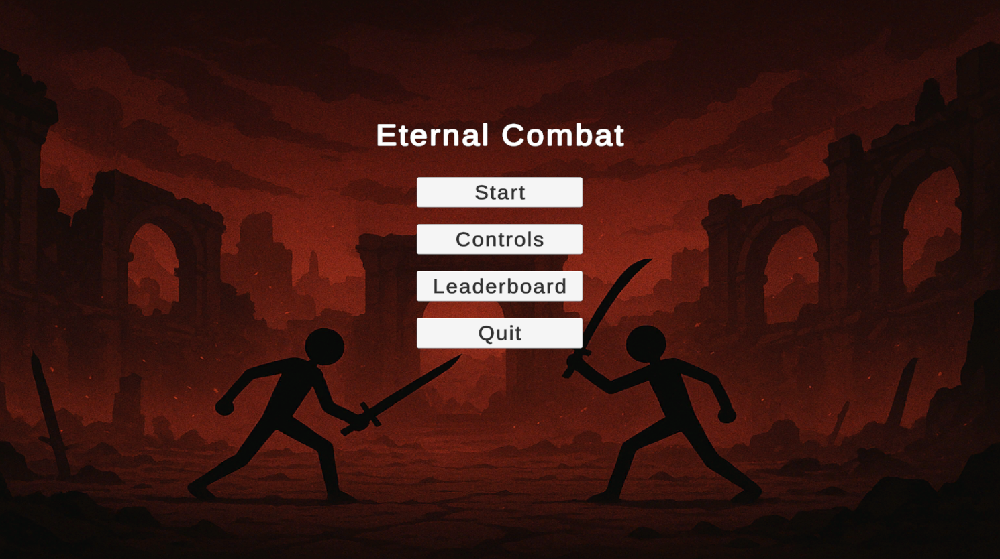
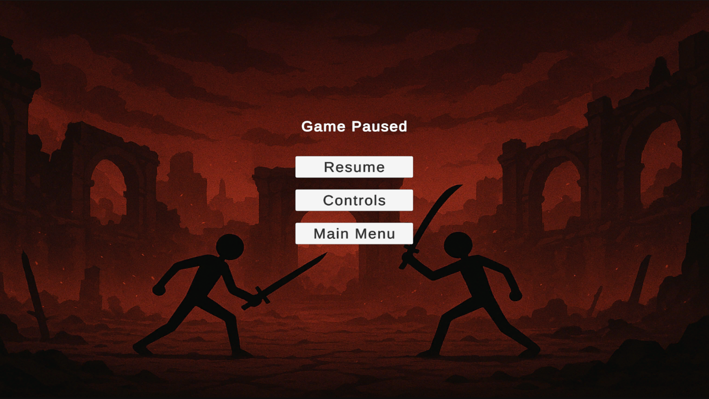
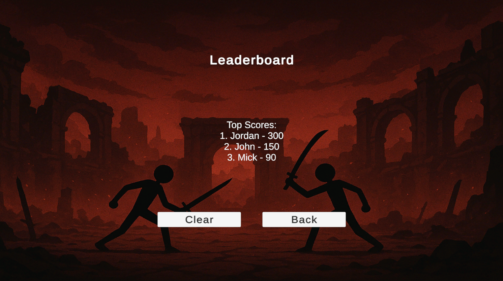

# eternal-combat-unity

## Description
A Unity-based game developed using C#, featuring player interaction systems, UI design, and gameplay mechanics.

## Features
- Main menu and navigation system
- Pause menu and control settings interface
- In-game UI for player interaction
- Leaderboard system to track player performance

## Technologies
- Unity
- C#

## My Contributions
- Designed and implemented the main menu, pause menu, and control settings UI
- Developed leaderboard system to track and display player performance
- Built and integrated in-game UI elements for gameplay interaction

## What I Learned
- Unity UI system and canvas workflow
- Event-driven programming in game development
- Managing game states (menus, pause, gameplay)

## Screenshots

### Main Menu

### Gameplay UI

### Pause Menu

### Leaderboard

